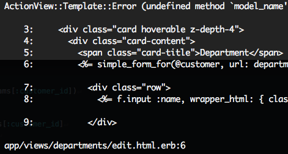
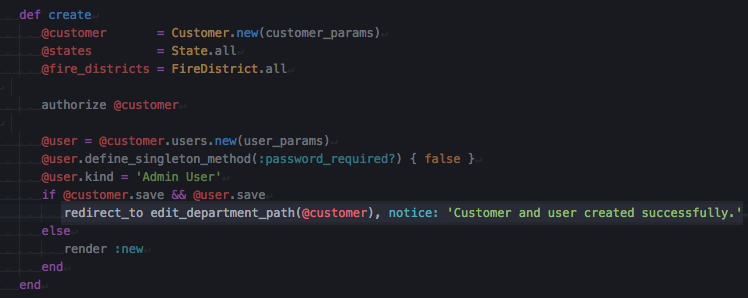
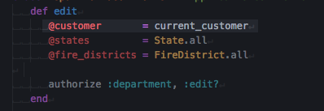
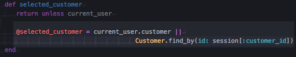

#### Bug when creating a new customer.

---
*The source of this bug was the following:*

After creating a new customer the user is redirected to the `department` edit view.

But for the form rendered by the `departments#edit` action to be properly rendered a customer is needed and suck customer is sought after using the controller helper method `current_customer`

But such method is not functional on this use case, since the newly created customer was not "selected" through his id on the session storage and the `current_user` it's not related to it.

<iframe src="https://streamable.com/s/pg6ia/nvobbs" frameborder="0" width="100%" height="100%" allowfullscreen style="width:100%;height:100%;position:absolute;left:0px;top:0px;overflow:hidden;"></iframe>

